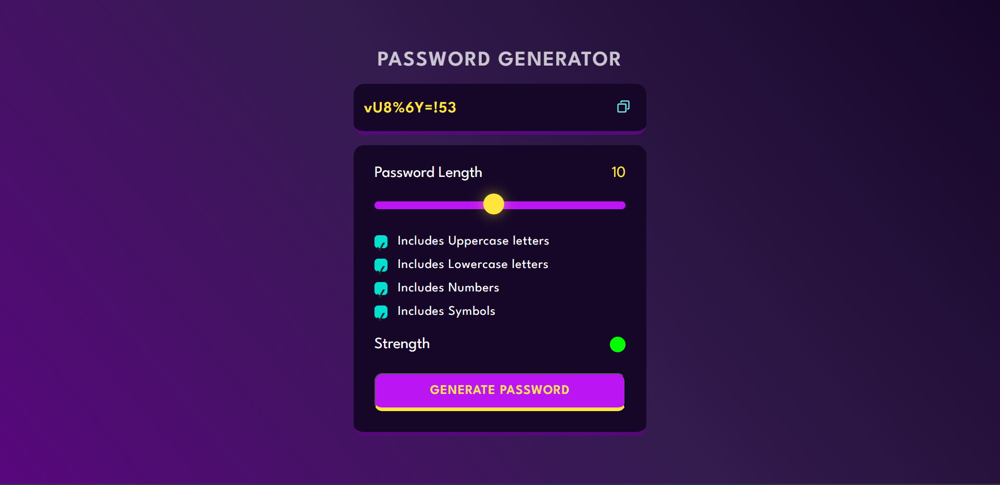

## Password Generator
This is a simple password generator project that generates a random password using mostly JavaScript with basic HTML styling in CSS. The user can select the length of the password and choose to include or exclude uppercase letters, lowercase letters, numbers, and special characters.

## Getting Started

To get started with this project, 
 https://github.com/ramgpal/counterApp.git
  
through the above link you can simply download or clone the repository to your local machine. Once you have the files on your machine, you can open the index.html file in your web browser to view the password generator.

## How to Use

Click -> http://lnkiy.in/password-generator  
Select the desired length of your password using the slider or input field. 
Check or uncheck the options to include or exclude uppercase letters, lowercase letters, numbers, and special characters. 
Click the "Generate Password" button to generate a random password. 
Your generated password will be displayed in the text area. 
## Technologies Used

<ol>
  <li>Javascript</li>
  <li>HTML</li>
  <li>CSS</li>
</ol>

## Acknowledgments

This project was inspired by the need for a simple password generator tool that could be used by anyone. 

## Here's an image of my project:

